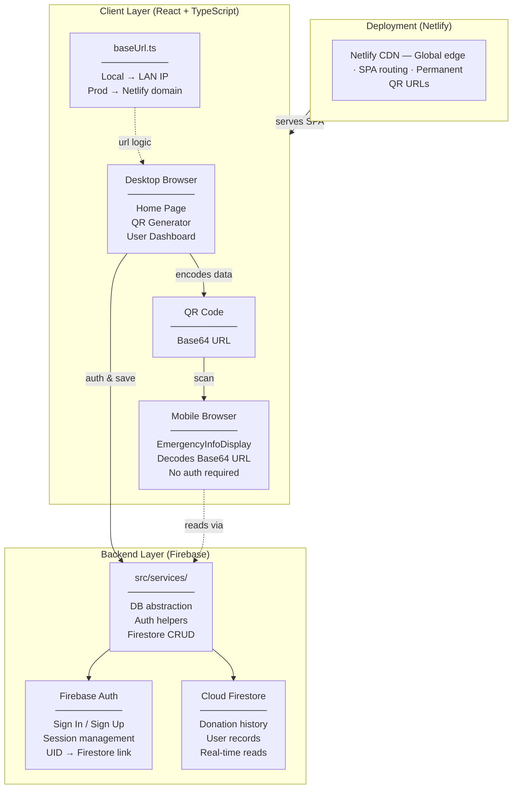
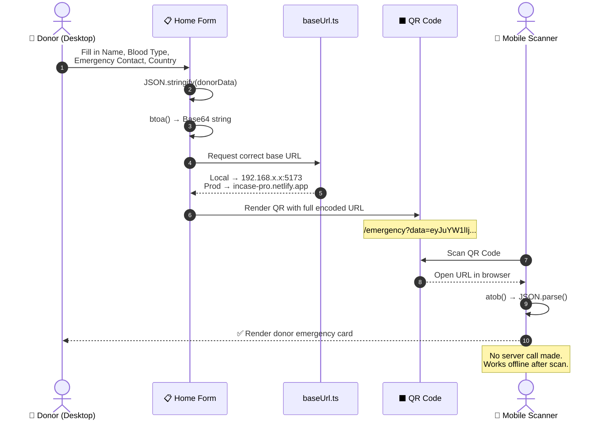
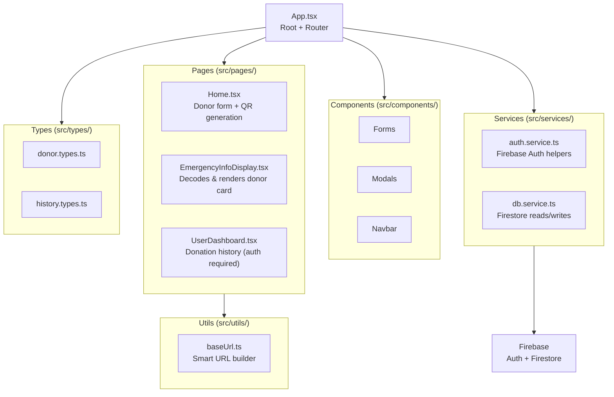

<div align="center">

# 🩸 INcase — Blood Donation QR App

### Emergency health information, instantly shareable via QR code.
### Enter your donor details once — anyone with a smartphone can access them in seconds.

[](https://reactjs.org/)
[](https://www.typescriptlang.org/)
[](https://firebase.google.com/)
[](https://vitejs.dev/)
[](https://tailwindcss.com/)
[](https://netlify.com/)

**[🌐 Live Demo](https://incase-pro.netlify.app)** • **[📖 Project Guide](./PROJECT_GUIDE.md)** • **[🐛 Report Issue](https://github.com/Piyush-Jhajhria/INcase/issues)**

</div>

---

## 📋 Table of Contents

- [Overview](#-overview)
- [System Architecture](#-system-architecture)
- [QR Code Data Flow](#-qr-code-data-flow)
- [Component Architecture](#-component-architecture)
- [Tech Stack](#-tech-stack)
- [Data Models](#-data-models)
- [Environment Setup](#-environment-setup)
- [Quick Start](#-quick-start)
- [Project Structure](#-project-structure)
- [Deployment](#-deployment-netlify)
- [Troubleshooting](#-troubleshooting)
- [Dependencies](#-dependencies)

---

## 🔍 Overview

INcase bridges the gap between desktop data entry and mobile accessibility for blood donors.

| What it does | How |
|---|---|
| 🩸 **Emergency Profiles** | Donor enters name, blood type, and emergency contact on desktop |
| ⬛ **Instant QR Sharing** | App generates a QR code with data encoded directly in the URL (Base64) |
| 📱 **Zero-install mobile view** | Anyone who scans the QR sees the donor card — no login, no app needed |
| 🗂️ **Donation History** | Authenticated users track past donations via a Firebase-backed dashboard |

> **Key design decision:** Emergency info requires **no server round-trip**. The entire payload travels inside the QR URL via Base64 encoding — meaning the card works even without internet after scanning.

---

## 🏗️ System Architecture

The app is built across three layers: a React SPA in the browser, Firebase for auth and data persistence, and Netlify for global CDN delivery.



---

## ⬛ QR Code Data Flow

The core innovation of INcase: no backend is involved when viewing emergency information. The data lives entirely in the URL.



---

## 🗂️ Component Architecture



---

## 🛠️ Tech Stack

| Layer | Technology | Purpose |
|---|---|---|
| **Frontend** | React 18 + TypeScript | UI framework with full type safety |
| **Styling** | Tailwind CSS | Utility-first responsive design |
| **Routing** | React Router DOM v6 | Client-side SPA navigation |
| **Animations** | Framer Motion | Page transitions and micro-interactions |
| **QR Code** | qrcode.react | In-browser QR code generation |
| **Icons** | Lucide React | Consistent icon system |
| **Backend** | Firebase Auth + Firestore | Authentication and real-time database |
| **Build** | Vite | Fast dev server and production bundler |
| **Deployment** | Netlify | Global CDN with SPA redirect support |

---

## 📐 Data Models

### `DonorInfo`
```typescript
interface DonorInfo {
  name: string;              // Donor's full name
  bloodType: string;         // e.g. "A+", "O-", "AB+"
  emergencyContact: string;  // Name + phone of emergency contact
  country: string;           // Country of residence
}
```

### `QRPayload`
```typescript
interface QRPayload {
  url: string;  // Full URL with Base64-encoded DonorInfo in query params
                // e.g. https://incase-pro.netlify.app/emergency?data=eyJ...
}
```

### `DonationHistory` *(Firestore)*
```typescript
interface DonationHistory {
  userId: string;            // Firebase UID of the authenticated donor
  donationDate: Timestamp;   // Firestore Timestamp of the donation
  location: string;          // Donation centre or location name
}
```

---

## ⚙️ Environment Setup

Copy `.env.example` to `.env` and fill in your Firebase project credentials.

```bash
cp .env.example .env
```

```env
# .env — never commit this file

VITE_FIREBASE_API_KEY=YOUR_FIREBASE_API_KEY
VITE_FIREBASE_AUTH_DOMAIN=YOUR_FIREBASE_AUTH_DOMAIN
VITE_FIREBASE_PROJECT_ID=YOUR_FIREBASE_PROJECT_ID
VITE_FIREBASE_STORAGE_BUCKET=YOUR_FIREBASE_STORAGE_BUCKET
VITE_FIREBASE_MESSAGING_SENDER_ID=YOUR_FIREBASE_MESSAGING_SENDER_ID
VITE_FIREBASE_APP_ID=YOUR_FIREBASE_APP_ID
VITE_FIREBASE_MEASUREMENT_ID=YOUR_FIREBASE_MEASUREMENT_ID
```

> ⚠️ `.env` is already listed in `.gitignore`. Get your credentials from [Firebase Console](https://console.firebase.google.com) → Project Settings → Your apps.

---

## 🚀 Quick Start

```bash
# 1. Clone the repository
git clone https://github.com/Piyush-Jhajhria/INcase.git
cd INcase

# 2. Install dependencies
npm install

# 3. Configure environment
cp .env.example .env
# Edit .env with your Firebase credentials

# 4. Start dev server (LAN-accessible for mobile QR testing)
npm run dev:local
```

> 📱 **Mobile testing:** Look for the **Network** URL in your terminal (e.g. `http://192.168.1.5:5173`). Open that address on your phone — both devices must be on the **same Wi-Fi network**.

### Available Scripts

| Command | Description |
|---|---|
| `npm run dev:local` | Starts Vite dev server with `--host` for LAN/mobile access |
| `npm run build` | Production build output to `dist/` |
| `npm run preview` | Preview the production build locally |
| `npm run lint` | Run ESLint across the codebase |

---

## 📁 Project Structure

```
INcase/
├── src/
│   ├── pages/                        # Main application views
│   │   ├── Home.tsx                  # Donor form + QR code generation
│   │   ├── EmergencyInfoDisplay.tsx  # Mobile emergency card (no auth)
│   │   └── UserDashboard.tsx         # Authenticated donation history
│   ├── components/                   # Reusable UI blocks
│   │   ├── Forms/
│   │   ├── Modals/
│   │   └── Navbar/
│   ├── services/                     # Firebase interaction layer
│   │   ├── auth.service.ts
│   │   └── db.service.ts
│   ├── types/                        # TypeScript type definitions
│   └── utils/
│       └── baseUrl.ts                # ⭐ Smart URL builder (local vs prod)
├── .env.example                      # Environment variable template
├── .gitignore
├── index.html                        # Vite entry point
├── netlify.toml                      # Netlify SPA redirect config
├── tailwind.config.js
├── tsconfig.json
├── vite.config.ts
└── package.json
```

---

## ▲ Deployment (Netlify)

```bash
# Login to Netlify CLI
netlify login

# Deploy to production
netlify deploy --prod
```

Once deployed, `baseUrl.ts` automatically detects the production environment and generates QR codes pointing to `https://incase-pro.netlify.app/...` instead of a local IP — making them **permanently scannable from anywhere**.

### Why deploy?

| Benefit | Detail |
|---|---|
| 🌐 **Global access** | Works from any network, not just local Wi-Fi |
| 🔗 **Permanent QR codes** | Generated QRs stay valid forever |
| ⚡ **Instant SPA routing** | `netlify.toml` handles `/*` redirect to `index.html` |

---

## 🔧 Troubleshooting

| Issue | Likely Cause | Fix |
|---|---|---|
| `"Webpage unavailable"` on mobile | Phone not on same Wi-Fi | Connect both devices to the same network |
| QR shows `localhost` instead of IP | App opened via `localhost` before QR generation | Open the app via the terminal's **Network** IP first |
| Port 5173 blocked on mobile | OS firewall blocking the Vite dev port | Allow port `5173` in your system firewall |
| Firebase auth errors on startup | Missing or incorrect `.env` values | Verify all `VITE_FIREBASE_*` vars are set correctly |

---

## 📦 Dependencies

### Runtime

| Package | Version | Purpose |
|---|---|---|
| `react` | `^18.3.1` | UI framework |
| `react-dom` | `^18.3.1` | DOM rendering |
| `react-router-dom` | `^6.22.1` | Client-side routing |
| `firebase` | `^10.5.0` | Auth and Firestore backend |
| `qrcode.react` | `^3.1.0` | QR code generation |
| `framer-motion` | `^11.0.5` | Animations |
| `lucide-react` | `^0.344.0` | Icon library |

### Dev

| Package | Version | Purpose |
|---|---|---|
| `vite` | `^5.4.2` | Build tool and dev server |
| `typescript` | `^5.5.3` | Type safety |
| `tailwindcss` | `^3.4.1` | Utility-first CSS framework |
| `eslint` | `^9.9.1` | Code linting |
| `@vitejs/plugin-react` | `^4.3.1` | React fast refresh |

---

<div align="center">

Made with ❤️ by [Piyush Jhajhria](https://github.com/Piyush-Jhajhria)

**[⬆ Back to top](#-incase--blood-donation-qr-app)**

</div>
